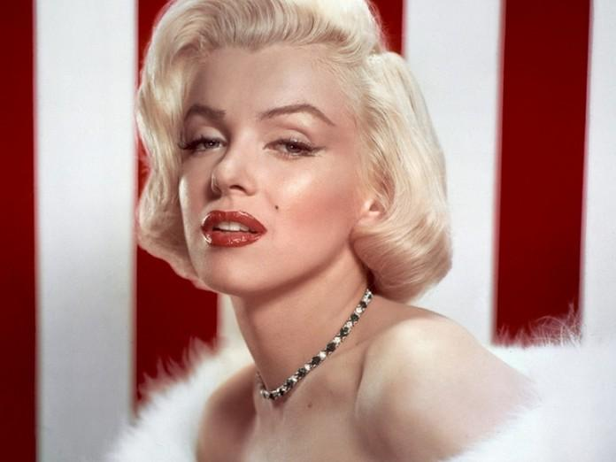
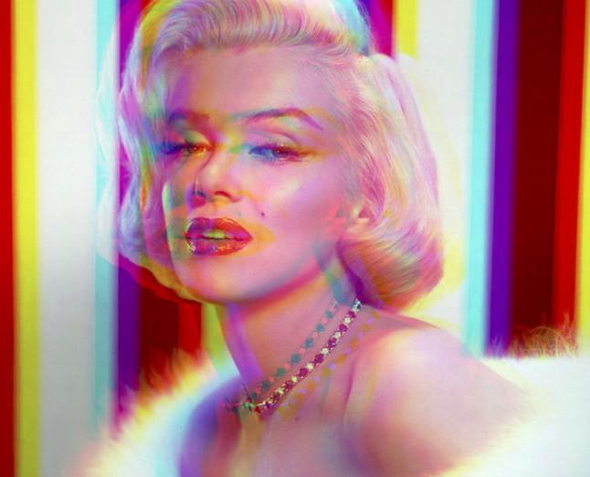

# Получить аватарку из изображения.
Получает аватарку с новыми цветами, смешивая цвета RGB.

## Окружение
### Подготовка Linux:<br>

Скачать git:
```bash
sudo apt-get install git
```
Сделать fork репозитория:
```bash
git clone https://github.com/NankuF/dvmn_picture.git
```
Перейти в директорию со скриптом:
```bash
cd ~ && cd dvmn_picture/
```
Создать виртуальное окружение:
```bash
python -m venv venv
```
Активировать виртуальное окружение:
```bash
. ./venv/bin/activate
```
Установить зависимости:
```bash
pip install -r requirements.txt 
```

## Запуск: <br>

1. Положить картинки в формате jpg в директорию `need_modified`.

2. Находясь в корне директории `dvmn_pictures` ввести в консоли код:
```bash
python main.py
```

## Результат:
Аватарки появятся в директории `avatars`, полноразмерные измененные изображения появятся в директории `modified_pictures`
1. Аватарка в пределах 80 пикселей
2. Полноразмерное изображение <br>

Было:

Стало: <br>


 
